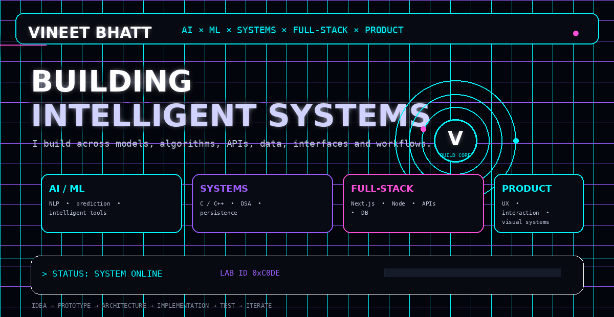
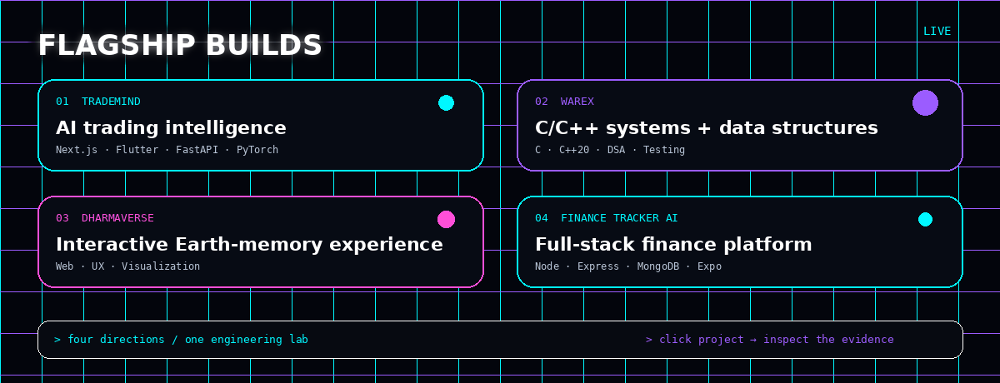
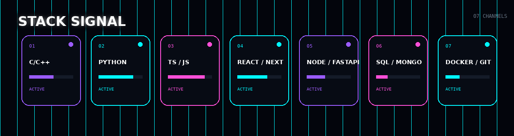

<div align="center">



<br>



<br>



</div>

---

## `// PROFILE`

I build at the intersection of **AI/ML, systems, full-stack engineering, and product design**.

My repositories are experiments, systems, and products that make the whole path visible:

`idea → architecture → implementation → testing → iteration`

### `// CURRENTLY BUILDING`

```text
01  TradeMind       AI / market intelligence / multi-platform systems
02  DHARMAVERSE     interactive geography / culture / visualization
03  WAREX           C/C++ / data structures / persistence / testing
04  Finance Tracker AI   full-stack finance workflows + mobile
```

---

<div align="center">

### `OPEN THE LAB`

<a href="https://github.com/VineetBhatt-bit/Trade-Mind">TRADEMIND</a>
&nbsp;&nbsp;◆&nbsp;&nbsp;
<a href="https://github.com/VineetBhatt-bit/WAREX">WAREX</a>
&nbsp;&nbsp;◆&nbsp;&nbsp;
<a href="https://github.com/VineetBhatt-bit/DHARMAVERSE">DHARMAVERSE</a>
&nbsp;&nbsp;◆&nbsp;&nbsp;
<a href="https://github.com/VineetBhatt-bit/finance-tracker-ai">FINANCE TRACKER AI</a>

</div>

---

## `// ENGINEERING MAP`

```text
AI / ML
├── NLP
├── prediction systems
├── intelligent assistants
└── model-driven products

SYSTEMS
├── C / C++
├── data structures & algorithms
├── persistence
└── testing / sanitizers

FULL-STACK
├── React / Next.js
├── Node / FastAPI
├── APIs
└── databases

PRODUCT
├── interaction design
├── visual systems
└── experience prototypes
```

---

## `// WHAT YOU WILL FIND HERE`

| Layer | Evidence |
|---|---|
| Build | working repositories, not only concepts |
| Systems | algorithms, architecture, persistence |
| AI/ML | NLP, prediction, intelligent workflows |
| Product | interfaces, interaction models, user workflows |
| Engineering | tests, documentation, iteration |

---

<div align="center">

`BUILD • BREAK • LEARN • ITERATE`

<br>

<a href="https://github.com/VineetBhatt-bit">github.com/VineetBhatt-bit</a>

</div>
