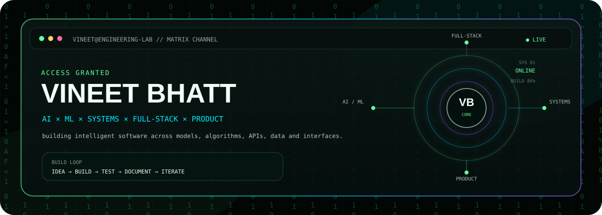
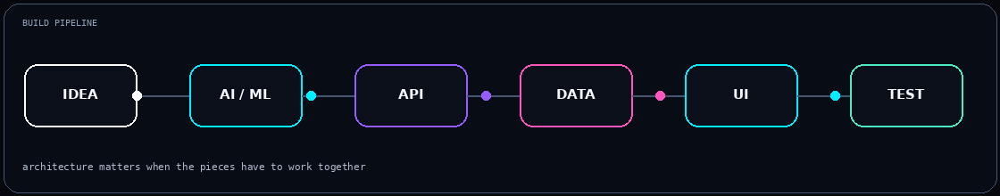

<div align="center">



</div>

<div align="center">

<sub>◈ MATRIX CHANNEL // ENGINEERING LAB // AI × ML × SYSTEMS</sub>

</div>

## `01 / WHO`

**Vineet Bhatt** — building across **AI/ML, systems, full-stack engineering, and product design**.

I prefer projects where the layers have to meet: models → algorithms → APIs → data → interfaces → testing → iteration.

<div align="center">

</div>

---

## `02 / FLAGSHIP BUILDS`

### 🧠 [TradeMind](https://github.com/VineetBhatt-bit/Trade-Mind)
AI-powered trading intelligence platform spanning web, mobile/desktop, backend services and ML infrastructure.

`Next.js` `Flutter` `FastAPI` `PyTorch` `PostgreSQL` `Redis` `Docker`

### ⚙️ [WAREX](https://github.com/VineetBhatt-bit/WAREX)
C/C++ inventory system combining data structures, persistence, API integration, automated tests and sanitizer checks.

`C` `C++20` `CMake` `DSA` `HTTP` `Testing`

### 🌍 [DHARMAVERSE](https://github.com/VineetBhatt-bit/DHARMAVERSE)
Interactive Earth-memory experience combining exploration, cultural archives, visualization, graph relationships and interface design.

`Web` `UX` `Visualization` `Interaction`

### 💰 [Finance Tracker AI](https://github.com/VineetBhatt-bit/finance-tracker-ai)
Full-stack finance platform with transaction workflows, analytics, approvals, budgets, mobile experience and shared backend data.

`Node.js` `Express` `MongoDB` `React Native` `Expo`

---

## `03 / STACK`

<div align="center">


</div>

---

## `04 / ENGINEERING FOCUS`

```text
AI / ML       NLP • prediction • intelligent workflows
SYSTEMS       C/C++ • DSA • persistence • testing
FULL-STACK    React • Next.js • Node • APIs • databases
PRODUCT       UX • interaction • visual systems
```

---

## `05 / BUILD LOOP`

<div align="center">

`IDEA` ───→ `PROTOTYPE` ───→ `ARCHITECTURE` ───→ `BUILD`
&nbsp;&nbsp;→&nbsp;&nbsp;
`TEST` ───→ `DOCUMENT` ───→ `ITERATE`

</div>

---

## `06 / CURRENTLY`

```text
▸ TradeMind        AI + multi-platform architecture
▸ DHARMAVERSE      interaction + visualization
▸ WAREX            systems + testing + documentation
▸ AI experiments   turning prototypes into measurable projects
```

---

## `07 / RESEARCH / EXPERIMENTS`

[AI Resume Analyzer](https://github.com/VineetBhatt-bit/AI-Resume-Analyzer) ·
[Sentiment Analysis Predictor](https://github.com/VineetBhatt-bit/Sentiment-Analysis-Predictor) ·
[TradeLearn AI](https://github.com/VineetBhatt-bit/TradeLearn-AI)

---

<div align="center">

### `BUILD SOMETHING WORTH INSPECTING.`

<a href="https://github.com/VineetBhatt-bit">github.com/VineetBhatt-bit</a>

</div>
