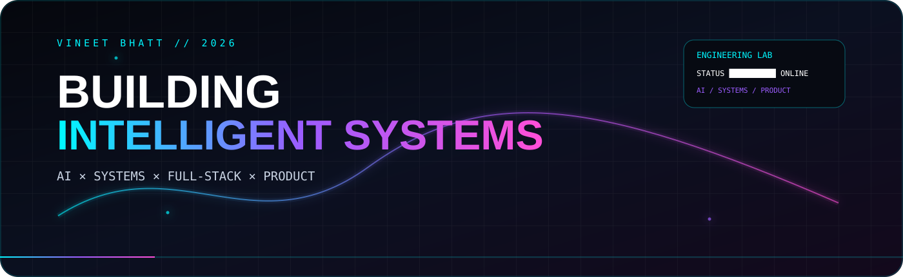
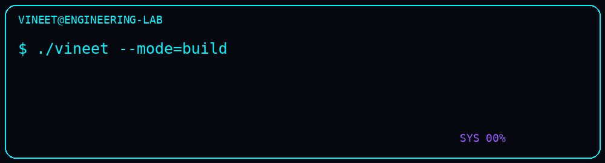
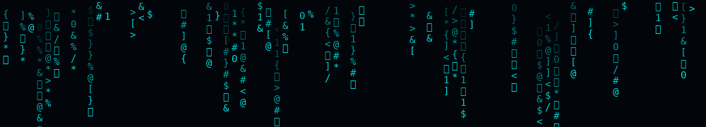
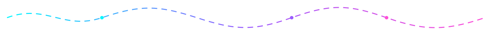

<div align="center">

<a href="https://github.com/VineetBhatt-bit">
  
</a>

<br/>

<a href="https://github.com/VineetBhatt-bit?tab=repositories">
  
</a>
<a href="https://github.com/VineetBhatt-bit/Trade-Mind">
  
</a>
<a href="https://github.com/VineetBhatt-bit/WAREX">
  
</a>

</div>

---

## `> booting vineet.dev...`

```text
┌─────────────────────────────────────────────────────────────────────┐
│  USER      : Vineet Bhatt                                          │
│  MODE      : BUILD                                                   │
│  FOCUS     : AI · SYSTEMS · FULL-STACK · PRODUCT ENGINEERING         │
│  STATUS    : ████████████████████  ONLINE                            │
│                                                                     │
│  "Don't just say you can build it. Make the repository prove it."   │
└─────────────────────────────────────────────────────────────────────┘
```





### `SYSTEM PROFILE`

I'm a builder working across **AI, software systems, full-stack products, and interactive experiences**.

I like projects that force multiple layers to meet: algorithms → APIs → data → interfaces → testing → real user workflows.

```text
AI / ML            ███████████████████░░  building
Full Stack         ████████████████████░  building
Systems / C / C++  ███████████████████░░  building
Product / UX       ████████████████████░  building
Cloud / DevOps     ███████████████░░░░░░  expanding
```

---

# ⚡ FLAGSHIP BUILDS

<table>
<tr>
<td width="50%" valign="top">

### 🧠 TradeMind
**AI-powered trading intelligence**

Multi-platform product architecture spanning web, mobile/desktop, backend APIs, ML, data infrastructure, and automation.

`Next.js` `Flutter` `FastAPI` `PyTorch` `PostgreSQL` `Redis` `Docker`

**[↗ Explore repository](https://github.com/VineetBhatt-bit/Trade-Mind)**

</td>
<td width="50%" valign="top">

### ⚙️ WAREX
**Data-structures + C/C++ system**

Inventory and order-management system using linked lists, hash lookup, BST traversal, stack/undo, queues, heaps, merge sort, persistence, automated tests and sanitizers.

`C` `C++20` `CMake` `HTTP` `Testing`

**[↗ Explore repository](https://github.com/VineetBhatt-bit/WAREX)**

</td>
</tr>

<tr>
<td width="50%" valign="top">

### 🌍 DHARMAVERSE
**Interactive Earth-memory experience**

A visual product concept that turns locations into living stories through atmosphere, memory streams, cultural archives, graph relationships, and exploration.

`Web` `UX` `Visualization` `Interaction Design`

**[↗ Explore repository](https://github.com/VineetBhatt-bit/DHARMAVERSE)**

</td>
<td width="50%" valign="top">

### 💰 Finance Tracker AI
**Full-stack finance platform**

Web + mobile finance workflows, transaction lifecycle, analytics, approvals, audit history, budgets, dashboards and shared backend data.

`Node.js` `Express` `MongoDB` `React Native` `Expo`

**[↗ Explore repository](https://github.com/VineetBhatt-bit/finance-tracker-ai)**

</td>
</tr>
</table>

---

# 🧩 ENGINEERING STACK

<div align="center">


</div>

---

<div align="center"></div>

# 🛰️ SYSTEM MAP

```text
                          ┌─────────────────────────┐
                          │       USER / IDEA       │
                          └────────────┬────────────┘
                                       │
                    ┌──────────────────┼──────────────────┐
                    ▼                  ▼                  ▼
              ┌──────────┐      ┌────────────┐      ┌─────────────┐
              │   AI/ML  │      │ FULL STACK │      │   SYSTEMS   │
              └────┬─────┘      └──────┬─────┘      └──────┬──────┘
                   │                   │                    │
                   ▼                   ▼                    ▼
              Models / NLP       APIs / DBs           DSA / C / C++
                   │                   │                    │
                   └───────────────────┼────────────────────┘
                                       ▼
                            ┌──────────────────────┐
                            │    PRODUCT LAYER     │
                            │ UI · UX · Workflows  │
                            └──────────┬───────────┘
                                       ▼
                            ┌──────────────────────┐
                            │    TEST / ITERATE    │
                            └──────────────────────┘
```

---

# 🔬 ENGINEERING LAB

| Track | Current direction |
|---|---|
| `AI` | NLP, prediction systems, intelligent assistants |
| `SYSTEMS` | C/C++, data structures, algorithms, persistence |
| `FULL STACK` | Next.js, React, Node, APIs, databases |
| `MOBILE` | React Native / Expo, Flutter |
| `PRODUCT` | Interaction design, visual systems, experience design |
| `INFRA` | Docker, automation, CI/CD foundations |

---

# 📈 LIVE ACTIVITY

<div align="center">


</div>

<div align="center">

</div>

---

# 🐍 CONTRIBUTION MATRIX

<div align="center">
  
</div>

---

# 🚧 CURRENTLY BUILDING

```text
[01]  TradeMind       →  expanding AI + multi-platform architecture
[02]  DHARMAVERSE     →  pushing interaction + cultural visualization
[03]  WAREX           →  hardening systems + testing + documentation
[04]  AI experiments   →  turning prototypes into measurable projects
```

---

# 🧪 SELECTED EXPERIMENTS

<a href="https://github.com/VineetBhatt-bit/AI-Resume-Analyzer">
  
</a>
<a href="https://github.com/VineetBhatt-bit/Sentiment-Analysis-Predictor">
  
</a>

---

# 🧠 BUILD PHILOSOPHY

```text
IDEA
 ↓
PROTOTYPE
 ↓
ARCHITECTURE
 ↓
IMPLEMENTATION
 ↓
TESTING
 ↓
DOCUMENTATION
 ↓
ITERATION
```

**The goal isn't to look like an engineer.  
The goal is to leave enough evidence that people don't have to ask.**

---

<div align="center">

### `TRANSMISSION COMPLETE`



<a href="https://github.com/VineetBhatt-bit">GitHub</a>
&nbsp;·&nbsp;
<a href="https://www.linkedin.com/">LinkedIn</a>
&nbsp;·&nbsp;
<a href="mailto:wildframevineet@gmail.com">Email</a>

<br/><br/>

`AI × SYSTEMS × PRODUCT`

</div>
